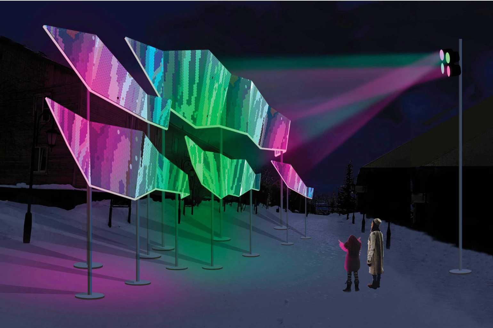

# Major project (Individual part)
##  Inspiration

#### This is the inspiration code link: [Link text](https://openprocessing.org/sketch/2383330)
Since our initial code was static, the inspiration I was looking for was dynamic water ripples，(details in video). 
So I wanted to make the static water surface dynamic in order to simulate the real waves,and create gradient colours for waves.      

Installation artwork ‘STAR FISHES GO NORTH’
In the installation artwork, dynamic LED lights transform objects into shiny shapes floating in the sky and changing colour over time.
I wanted to apply the effect of changing colours to the objects, and there is a uniformity in the colours of the waves and the clouds, so that it would be more coherent and beautiful.

## Details of my code
**Instructions:** 
+ Each time the page is refreshed, the colour of the waves and the colour of the clouds will change.
+ The canva size can be adjusted based on the window size.

### Animation Explanation: 
 Create dynamic images by changing the motion and colour of objects. The image retains elements of Monet's work, but also adds elements from the inspiration.
+ **Waves**
  + I specialise in creating dynamic waves using Perlin noise to make them more natural and realistic.
  + Changes the colour of the waves and clouds when you refresh the screen.
+ **Cloud**  
  + Changes the colour of the cloud when it resets its position.
  + Colour variations are similar in waves and clouds (same palette).


**Difference:**
+ Zichen Qiao：Change the trajectory of an object.
+ Rachel Huang:  Add music and animation.
+ Jiarui Song: Add buttons to control the objects.
+ Me: Change the state of motion of an object (static to dynamic)，Add a colour change effect.

**I choose the Perlin noise to drive my code**

### Technical Explanation
#### Iteration 1
``` js
let shapes = [];// An array to store all shapes
let bauhausWave = 5;// The number of waves
let maxHeight;// The maximum height of the wave
let wavePointNumber = 10;// The number of points in each wave
let noiseSeed;// The noise seed
let colourPalettes;// An array to store all colour palettes
let selectedPalette;// The selected colour palette
let skyWater = [];// An array to store all sky and water lines
```
**Annotation:** 
+ In this stage, I set up the Dynamic drawing of wave scenes, changes in wave colour，and Sky and water level management.

#### Iteration 2
``` js
// drawWave() function
function drawWave(layer){
  let baseHeight = map(layer, 0, bauhausWave, height / 2 , height);// Use map() to set up the base height
  let waveNoiseSeed = noiseSeed + layer; // Add the layer to the noise seed
  let waveColor = lerpColor(selectedPalette[0], selectedPalette[1], layer / bauhausWave);// Use lerpColor() to set up the wave color
  fill(waveColor);
  beginShape();
  vertex(0, baseHeight);
  // Draw the wave
  for (i = 0; i <= width ;i += 10 ) {
    let y = map(noise(waveNoiseSeed), 0, 1, -maxHeight, maxHeight);
    curveVertex(i, baseHeight + y);
    waveNoiseSeed += 0.015;
  }

vertex(width, baseHeight);
vertex(width, height);
vertex(0, height);
  endShape(CLOSE);
}
```
 **Annotation:** 
 + In this stage, I want to draw the dynamic waves so I use Perlin noise to generate wave shapes, which vary smoothly in the horizontal direction. 
 + I set the wave height and colour to create a dynamic water effect, and use gradient colours and dynamic height changes to make the waves look more natural.

 #### Iteration 3
 ``` js
// setup() function
function setup() {
  createCanvas(windowWidth, windowHeight);// Create the canvas
  maxHeight = height / 15;// Set the maximum height of the wave
  noiseSeed = random(100);// Set the noise seed
  loop(); 
  // Create the colour palettes
  colourPalettes = [
    [color (202, 220, 252), color (38, 182, 249)],
    [color(206, 230, 242), color ('#E3867D')],
    [color(221, 219, 222), color (101, 110, 119)],
    [color(25, 60, 150, 180), color(255, 190, 120, 180), color(255, 150, 100, 180), color(0, 100, 150, 180)],
  ];
  selectedPalette = random(colourPalettes);// Randomly select a colour palette
 ```
  **Annotation:** 
  + In this stage, I want to let the canvas adapt to the changes of the screen and change the colour of waves.   
  + I make the canva size adapts to the screen, set up the changes of height in waves and dynamic effects, and use multiple colour palettes and randomly select.

#### Iteration 4
``` js
  // Move the cloud
  move() {
    this.x += this.speedX;
    this.y += this.speedY;

    // If the cloud moves out of the left edge of the canvas, reset its position to the right edge
    if (this.x > width + this.size) {
      this.x = -this.size;
      this.color = random(selectedPalette);
    }
    // If the cloud moves out of the top or bottom edge of the canvas, reverse its moving direction
    if (this.y > height / 2 || this.y < 0) {
      this.speedY *= -1;
    }
  }
```
**Annotation:** 
+ In this stage, I want to change the colour of the clouds to resemble the colour of the water.
+ I set it up to randomly select a new colour from selectedPalette when the cloud resets its position and make the colour of the cloud change when they resets its position.

#### Iteration 5
``` js
// windowResized() function
function windowResized() {
  resizeCanvas(windowWidth, windowHeight);
  skyWater = [];// Reset the sky and water
  for (let y = 0; y < height / 2; y += 10) {
    let skyColor = lerpColor(color(25, 60, 150), color(255, 190, 120), y / (height / 2));
    skyWater.push(new BauhausRect(0, y, width, 10, skyColor)); 
  }
  for (let y = height / 2; y < height; y += 10) {
    let waterColor = lerpColor(color(255, 150, 100), color(0, 100, 150), (y - height / 2) / (height / 2));
    skyWater.push(new BauhausRect(0, y, width, 10, waterColor)); 
  }
} 
```
**Annotation:** 
+ In this stage, I want the canvas size to change dynamically along with the object when I resize the window. 
+ I set up windowresized function to adapt the different size of the screen and use skywater, bauhausrect to control the objects in order to adapt the changes of the screen. 

#### Conclusion
**Wave analysis**
+ Based on Perlin noise, dynamic height variations of waves can be generated. Further, by combining the colour gradient technique, it is possible to achieve smoothness and continuity of the water surface effect.This approach not only ensures the dynamic generation of wave heights, but also results in a natural and continuous gradient in the colour representation of the water.
+ NoiseSeed ensures that the wave form changes subtly with each frame. This update strategy is essential to simulate the dynamics of natural water flow effects. The constantly updated noiseSeed enables the randomness and continuity of waves, thus reproducing more realistically the complex dynamics of natural water flows.

**Cloud analysis**
+ Draw clouds through the BauhausCloud class to bring out their richness of layering as well as variety and depth. Use move() method to control the movement of the cloud horizontally and float vertically. This method is used to make the movement of the cloud more natural and vivid.
+ Random changes in the colour of the clouds have been implemented to enhance the visual dynamics, making the whole scene more vivid and engaging. In addition, when the clouds move beyond the scene boundaries, they reappear on the other side, a design that provides users with a continuous viewing experience.

**Colour change analysis**
+ Using lerpColor in the colour transitions of waves, sky and water, makes colour changes smooth and natural.
+ Using a random colour palette, it provides randomised visual effects for cloud colours in each run and in dynamic scenes.
+ Control by transparency, it provides translucent effects for elements such as waves and reflections, enhancing the realism and aesthetics of the scene. 


I use chatGpt and deepl to inspire visual design and report writing.

