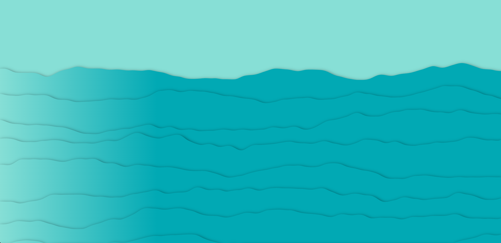

# Major project (Individual part)

## Group Code
``` js
let shapes = [];

// setup() function
function setup() {
  createCanvas(800, 600);
  loop(); 
  
  //create the sky and water
  for (let y = 0; y < height / 2; y += 10) {
    let skyColor = lerpColor(color(25, 60, 150), color(255, 190, 120), y / (height / 2));
    shapes.push(new BauhausRect(0, y, width, 10, skyColor)); 
  }

 //create the water
  for (let y = height / 2; y < height; y += 10) {
    let waterColor = lerpColor(color(255, 150, 100), color(0, 100, 150), (y - height / 2) / (height / 2));
    shapes.push(new BauhausRect(0, y, width, 10, waterColor)); 
  }

  //create the building
  shapes.push(new BauhausRect(220, 80, 30, 100, color(0, 0, 0))); //left part
  shapes.push(new BauhausRect(210, 120, 50, 80, color(20, 10, 60))); // middle part
  shapes.push(new BauhausRect(190, 180, 300, 120, color(50, 30, 80))); // right part

  // Add the reflection of the building on the water
  shapes.push(new BauhausRect(220, 300, 80, 200, color(0, 0, 0, 80))); // top reflection, transparent black
  shapes.push(new BauhausRect(230, 450, 50, 80, color(20, 10, 60, 80))); // middle reflection, transparent purple
  shapes.push(new BauhausRect(250, 500, 30, 60, color(150, 30, 80, 80))); // bottom reflection, transparent red

  // Add the windows of the building
  for (let i = 0; i < 20; i++) {
    shapes.push(new BauhausLine(random(width), random(height / 2, height), random(50, 150), 0, color(255, 100, 50, 100))); 
  }

  // Add the sun
  shapes.push(new BauhausCircle(600, 100, 80, color(255, 200, 50, 180))); 

  // Add the clouds
  shapes.push(new BauhausCloud(100, 70, 90, 200)); // The first cloud
  shapes.push(new BauhausCloud(300, 50, 120, 230)); // The second cloud
  shapes.push(new BauhausCloud(500, 100, 100, 180)); // The third cloud
  shapes.push(new BauhausCloud(650, 80, 130, 200)); // The fourth cloud
  shapes.push(new BauhausCloud(750, 120, 85, 220)); // The fifth cloud
}

// draw() function
function draw() {
  background(255);
  
  // Draw all shapes
  for (let shape of shapes) {
    shape.draw();
    if (shape instanceof BauhausCloud) {
      shape.move(); // Move the clouds
    }
  }
}

// BauhausShape class
class BauhausShape {
  constructor(x, y, color) {
    this.x = x;
    this.y = y;
    this.color = color;
  }
}

// BauhausRect class
class BauhausRect extends BauhausShape {
  constructor(x, y, width, height, color) {
    super(x, y, color);
    this.width = width;
    this.height = height;
  }

  draw() {
    fill(this.color);
    noStroke();
    rect(this.x, this.y, this.width, this.height);
  }
}

// BauhausCircle class
class BauhausCircle extends BauhausShape {
  constructor(x, y, size, color) {
    super(x, y, color);
    this.size = size;
  }
// Draw the circle
  draw() {
    fill(this.color);
    noStroke();
    ellipse(this.x, this.y, this.size);
  }
}

// BauhausLine class
class BauhausLine {
  constructor(x, y, length, angle, color) {
    this.x = x;
    this.y = y;
    this.length = length;
    this.angle = angle;
    this.color = color;
  }
// Draw the line
  draw() {
    stroke(this.color);
    strokeWeight(2);
    push();
    translate(this.x, this.y);
    rotate(radians(this.angle));
    line(0, 0, this.length, 0);
    pop();
  }
}

// Cloud class，Use multiple circles to form clouds and add motion effects
class BauhausCloud extends BauhausShape {
  constructor(x, y, size, alpha) {
    super(x, y, color(255, 255, 255, alpha)); 
    this.size = size; // The size of the cloud
    this.speedX = random(0.2, 1); // The random speed of the cloud on the x-axis (move left and right)
    this.speedY = random(-0.2, 0.2); // The random speed of the cloud on the y-axis (move up and down)
  }

  // Draw the cloud
  draw() {
    noStroke();
    fill(this.color);

    // Draw the cloud with multiple ellipses
    ellipse(this.x, this.y, this.size, this.size * 0.5); 
    ellipse(this.x - this.size * 0.4, this.y + this.size * 0.2, this.size * 0.6, this.size * 0.4); // The left ellipse
    ellipse(this.x + this.size * 0.4, this.y + this.size * 0.2, this.size * 0.6, this.size * 0.4); // The right ellipse
    ellipse(this.x - this.size * 0.2, this.y - this.size * 0.2, this.size * 0.5, this.size * 0.3); // The top ellipse
    ellipse(this.x + this.size * 0.2, this.y - this.size * 0.2, this.size * 0.5, this.size * 0.3); // The bottom ellipse
  }

  // Move the cloud
  move() {
    this.x += this.speedX;
    this.y += this.speedY;

    // If the cloud moves out of the left edge of the canvas, reset its position to the right edge
    if (this.x > width + this.size) {
      this.x = -this.size;
    }
    // If the cloud moves out of the top or bottom edge of the canvas, reverse its moving direction
    if (this.y > height / 2 || this.y < 0) {
      this.speedY *= -1;
    }
  }
}
```
##  Inspiration
#### Screenshot

#### This is the link: [Link text](https://openprocessing.org/sketch/2383330)
Since our initial code was static, the inspiration I was looking for was dynamic water ripples，details in video. So I wanted to make the static water surface dynamic, hence the addition of waves and different colours. Aditionally,  

## Details of my code
#### Iteration 1
``` js
let shapes = [];// An array to store all shapes
let bauhausWave = 5;// The number of waves
let maxHeight;// The maximum height of the wave
let wavePointNumber = 10;// The number of points in each wave
let noiseSeed;// The noise seed
let colourPalettes;// An array to store all colour palettes
let selectedPalette;// The selected colour palette
let skyWater = [];// An array to store all sky and water lines
```
Annotation: In this stage, I set up the Dynamic drawing of wave scenes, changes in wave colour，and Sky and water level management.

#### Iteration 2
``` js
// drawWave() function
function drawWave(layer){
  let baseHeight = map(layer, 0, bauhausWave, height / 2 , height);// Use map() to set up the base height
  let waveNoiseSeed = noiseSeed + layer; // Add the layer to the noise seed
  let waveColor = lerpColor(selectedPalette[0], selectedPalette[1], layer / bauhausWave);// Use lerpColor() to set up the wave color
  fill(waveColor);
  beginShape();
  vertex(0, baseHeight);
  // Draw the wave
  for (i = 0; i <= width ;i += 10 ) {
    let y = map(noise(waveNoiseSeed), 0, 1, -maxHeight, maxHeight);
    curveVertex(i, baseHeight + y);
    waveNoiseSeed += 0.015;
  }

vertex(width, baseHeight);
vertex(width, height);
vertex(0, height);
  endShape(CLOSE);
}
```
 Annotation: In this stage, I use Perlin noise to generate wave shapes, which vary smoothly in the horizontal direction, set the wave height and colour to create a dynamic water effect, and use gradient colours and dynamic height changes to make the waves look more natural.

 #### Iteration 3
 ``` js
// setup() function
function setup() {
  createCanvas(windowWidth, windowHeight);// Create the canvas
  maxHeight = height / 15;// Set the maximum height of the wave
  noiseSeed = random(100);// Set the noise seed
  loop(); 
  // Create the colour palettes
  colourPalettes = [
    [color (202, 220, 252), color (38, 182, 249)],
    [color(206, 230, 242), color ('#E3867D')],
    [color(221, 219, 222), color (101, 110, 119)],
    [color(25, 60, 150, 180), color(255, 190, 120, 180), color(255, 150, 100, 180), color(0, 100, 150, 180)],
  ];
  selectedPalette = random(colourPalettes);// Randomly select a colour palette
 ```
  Annotation: IN this stage, I make the canva size adapts to the screen, set up the changes of height in waves and dynamic effects, and use multiple colour palettes and randomly select

  
